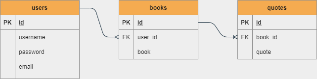

# Quoteara

#### Video Demo: URL [here](https://youtu.be/jnUWwlG-0Kk).

## Description:

Final project for [CS50x](https://cs50.harvard.edu/x/2021/).

Quoteara is a web app via which users can manage their quotes. This tool allows users to import quotes and save their list of read books (or books for which they want to save quotes).
The user will have to create an account and be logeed in for accessing the app functionalities.
Quotes can be added either by text or by converting images to text.

## Tech/frameworks

- Python Flask project, organised with MVC design pattern
- MySQL database for user data
- JavaScript

- [Google books API](https://developers.google.com/books/docs/v1/using), used for searching books and retreive book information
- [Jinja](https://jinja.palletsprojects.com/en/3.0.x/templates/) templates
- CSS/Bootstrap

### Python Libraries:

- [mysqlclient](https://pypi.org/project/mysqlclient/) as MySQL connector for Python
- [Flask-MySQLdb](https://flask-mysqldb.readthedocs.io/en/latest/) as MySQL connection for Flask
- [Werkzeug](https://werkzeug.palletsprojects.com/en/2.0.x/) for hashing user passwords
- [python-dotenv](https://github.com/theskumar/python-dotenv) for reading the virtual environment variables
- [Pillow](https://pillow.readthedocs.io/en/stable/) python library for processing the input file
- [Python Tesseract](https://github.com/madmaze/pytesseract) python library for recognising and reading text embedded in images

### Virtual environment

The project is build in a [virtual environment](https://code.visualstudio.com/docs/python/environments). The packages installed are listed in `requirements.txt`.
The connection credentials for the MySQL database are saved as environment varialbles in the `.env ` file. This file is found in the `env/` folder, which is added to `.gitignore` file.

### Image to text to quote

The image to be converted to text is uploaded via an `<input type="file">` HTML element. The input element is part of a form element, encoded as `multipart/form-data`. The file format and single file selection are checked with JavaScript functions (in `static/app.js`), before the file is further processed. The form data (the file image) is submitted to the server as a [FormData](https://developer.mozilla.org/en-US/docs/Web/API/FormData) using the `XMLHttpRequest.send()` method with AJAX.

### Database schema

## Usage

### Quoteara("/")

When user is not logged in: welcome message and instructions to login or register.

When user is logged in: list of the saved quotes

### "/addquote"

On this page the user will find a form for adding quotes. Each quote will be first associated with the book before submitting the form.

There are 2 options for adding the quote text:

- manualy in the text area
- by converting an image (photo of a book page) to text. The text area will be automatically filled in with the obtained text. The user can modify it before submitting the form

### "/books"

List of the saved quotes

### "/addbook"

Search for books by title or author.

## References

- source code for problem set 9 of CS50x, [Finance](https://cs50.harvard.edu/x/2021/psets/9/finance/)

- Upload files to web server [ref 1](https://developer.ibm.com/recipes/tutorials/uploading-files-to-web-server-using-ajax-xhr/), [ref 2](https://www.w3schools.com/xml/ajax_xmlhttprequest_send.asp), [ref 3](https://www.w3schools.com/xml/dom_http.asp), [ref 4](https://www.w3schools.com/js/js_ajax_http.asp)

- Check file format before submitting form [ref](https://stackoverflow.com/questions/7977084/check-file-type-when-form-submit)

- Formating Google Books API retreived information for search results as individual cards [ref](https://github.com/zentech/Book-Finder)

- Image to text [ref](https://www.geeksforgeeks.org/how-to-extract-text-from-images-with-python/)
